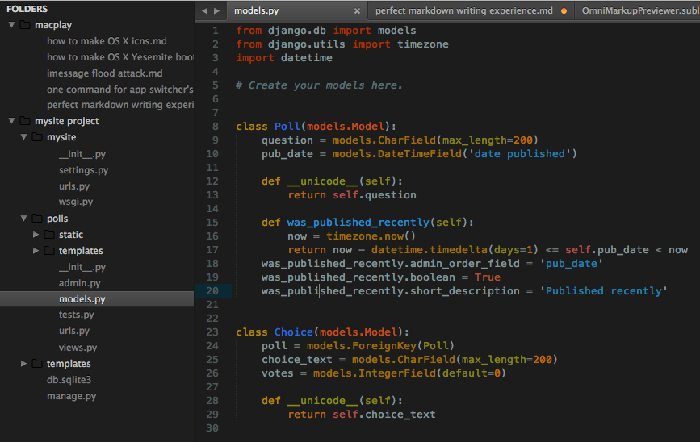
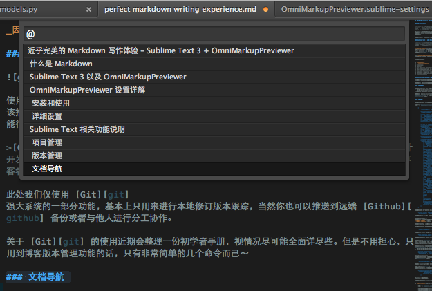
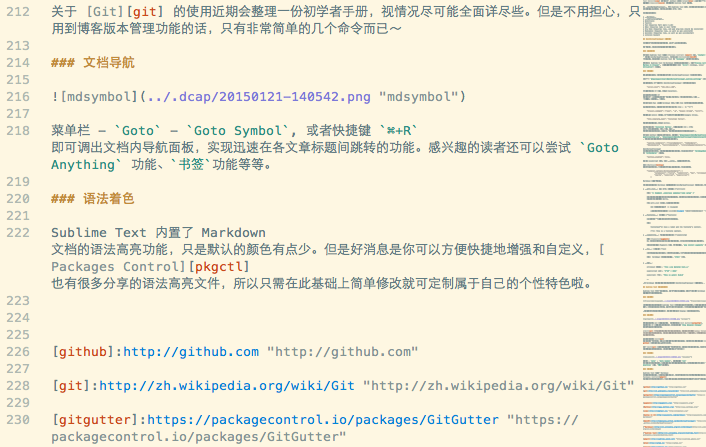
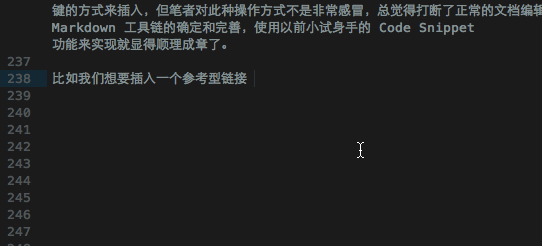

# 近乎完美的 Markdown 写作体验 - Sublime Text 3 + OmniMarkupPreviewer

<!-- [TOC] -->

## 什么是 Markdown

>Markdown 是一种轻量级标记语言，创始人为约翰·格鲁伯（John Gruber）。它允许人们“使用易读易写的纯文本格式编写文档，然后转换成有效的XHTML(或者HTML)文档”。 —— 来自维基百科 [^Markdown]

Markdown 创立的宗旨是实现「易读易写」。其语法简洁直观，你可以使用任何喜爱的文本编辑器来阅读和写作，更专注于书写的文字内容而不是排版样式。编辑完毕可轻松地导出成 HTML、PDF 等其它格式。

语法学习参考 : [Markdown 语法说明(简体中文版)][Syntax in SC]

## Sublime Text 3 以及 OmniMarkupPreviewer

>Sublime Text 是一套跨平台的文字編輯器，支持基於Python的外掛程式。Sublime Text 是專有軟體，可透過套件（Package）擴充本身的功能。大多數的套件使用自由軟體授權釋出，並由社群建置維護。 —— 来自维基百科 [^Sublime Text]

**Sublime Text** 作为近些年迅速崛起的后起之秀，凭借其精美的 UI 交互、完备的特色功能俘虏了一大批忠实用户。其风靡之势刺激了一些新老文本编辑器的重新思考和开发，开源实现 [Lime Text Editor][Lime] 无需多说，Github 主导的 [Atom][Atom] 以及号称下一代 Vim 编辑器的 [neovim][neovim] 都明确受到 Sublime Text 的影响。

而 **OmniMarkupPreviewer** 作为 Sublime Text 的一款强大插件，支持将标记语言渲染为 HTML 并在浏览器上实时预览，同时支持导出 HTML 源码文件。

支持的标记类语言:

- **Markdown**
- **reStructuredText**
- WikiCreole
- Textile
- Pod (Requires Perl >= 5.10)
- RDoc (Requires ruby in your PATH)
- Org Mode (Requires ruby, and gem org-ruby should be installed)
- MediaWiki (Requires ruby, as well as gem wikicloth)
- AsciiDoc (Requires ruby, as well as gem asciidoctor)
- Literate Haskell

## OmniMarkupPreviewer 设置详解

文章仅提供了简单的安装使用说明，以及个人较为关注的设置选项。

this is good for your name and reputation

想了解更多相关信息，请点击文档内链接并参考脚注部分。

### 安装和使用

你可以在 Sublime Text 内通过 [Package Control] [pkgctl] 输入 `Install Package` 来安装 OmniMarkupPreviewer, 也可以从其 [Github主页][OmniMP] 下载压缩包，解压到 Sublime Text 的 `Packages` 目录即可完成安装。

>_[Package Control] [pkgctl] - Sublime Text 的包管理器，简单好用，推荐安装_

**使用方法:** Sublime Text 内 Markdown 标签页点击鼠标右键 - 选择`Preview Current Markup in Browser`。 或者使用快捷键 (OSX `⌘+⌥+O`; Windows, Linux`Ctrl+Alt+O`) 来预览。

### 详细设置

OmniMarkupPreviewer 默认配置基本够用，但详细设置后才能将其特色功能充分发挥。

分享一下 `${packages}/User/OmniMarkupPreviewer.sublime-settings` 文件:

>_`${packages}` 路径为 `/Users/ashfinal/Library/Application Support/Sublime Text 3/Packages/`_

>_注意用户账号替换。可通过点击菜单栏 `Preferences` - `Browse Packages` 打开其 Finder 窗口_

    {
        "server_host": "192.168.1.100",

        "browser_command": ["open", "-a", "Google Chrome", "{url}"],

        // User public static files should be placed into
        //   ${packages}/User/OmniMarkupPreviewer/public/
        // User templates should be placed into:
        //   ${packages}/User/OmniMarkupPreviewer/templates/
        // Requires browser reload
        "html_template_name": "Evolution Yellow",

        // list of renderers to be ignored, case sensitive.
        // Valid renderers are: "CreoleRenderer", "MarkdownRenderer", "PodRenderer",
        //     "RDocRenderer", "RstRenderer", "TextitleRenderer"
        // for example, to disable Textile and Pod renderer:
        //   "ignored_renderers": ["TextitleRenderer", "PodRenderer"]
        "ignored_renderers": ["CreoleRenderer", "PodRenderer", "RDocRenderer", "TextitleRenderer", "LiterateHaskellRenderer"],

        "mathjax_enabled": false,

        // MarkdownRenderer options
        "renderer_options-MarkdownRenderer": {
            // Valid extensions:
            // - OFFICIAL (Python Markdown) -
            //   "extra": Combines ["abbr", "attr_list", "def_list", "fenced_code", "footnotes", "tables", "smart_strong"]
            //            For PHP Markdown Extra(http://michelf.ca/projects/php-markdown/extra/)
            //   "abbr": http://packages.python.org/Markdown/extensions/abbreviations.html
            //   "attr_list": http://packages.python.org/Markdown/extensions/attr_list.html
            //   "def_list": http://packages.python.org/Markdown/extensions/definition_lists.html
            //   "fenced_code": http://packages.python.org/Markdown/extensions/fenced_code_blocks.html
            //   "footnotes": http://packages.python.org/Markdown/extensions/footnotes.html
            //   "tables": http://packages.python.org/Markdown/extensions/tables.html
            //   "smart_strong": http://packages.python.org/Markdown/extensions/smart_strong.html
            //   "codehilite": http://packages.python.org/Markdown/extensions/code_hilite.html
            //   "meta": http://packages.python.org/Markdown/extensions/meta_data.html
            //   "toc": http://packages.python.org/Markdown/extensions/toc.html
            //   "nl2br": http://packages.python.org/Markdown/extensions/nl2br.html
            // - 3RD PARTY -
            //   "strikeout": Strikeout extension syntax - `This ~~is deleted text.~~`
            //   "subscript": Subscript extension syntax - `This is water: H~2~O`
            //   "superscript": Superscript extension syntax 0 `2^10^ = 1024`
            //   "smarty" or "smartypants": Python-Markdown extension using smartypants to emit
            //                   typographically nicer ("curly") quotes, proper
            //                   ("em" and "en") dashes, etc.
            //                   See: http://daringfireball.net/projects/smartypants/
            //                   And: https://github.com/waylan/Python-Markdown/blob/master/docs/extensions/smarty.txt
            "extensions": ["extra", "codehilite", "toc", "strikeout", "smarty", "subscript", "superscript"]
        }
    }

结合配置文件注释，来一起看下让 OmniMarkupPreviewer 更好用的诸多选项:

    "server_host": "192.168.1.100",

开启预览服务的 IP 地址, 默认为 localhost.
{#multipre}

此处建议设置为本机固定 IP. 其好处在于：从局域网内的任意一台设备均可访问，可多设备同时在线，实现 __一处编辑、多端预览__ 的效果。

你完全可以在 Mac 上编辑 Markdown 文档，而把 iPad 当作外接显示器来实时预览。

实际效果堪称完美，搞得我开始分外怀念已出手的 iPad ~ （；￣ェ￣）

    "browser_command": ["open", "-a", "Google Chrome", "{url}"],

预览默认为 Safari 浏览器，但一段时间下来发现最好使用 Google Chrome.

    "html_template_name": "Evolution Yellow",

预览使用的模板名称，默认为 Github.
{#usertpl}

此处为自定义模版 `Evolution Yellow`. 所谓模板其实就是非常简单的 CSS + HTML 文件，你可以修改背景、行宽、字体、边距 …… 等等样式相关的所有东西，甚至引入一些花哨的动画效果(你确定要这么做？)。

你可以在内置模板 Github 的基础上进行自定义，其路径为 `${packages}/OmniMarkupPreviewer/public/github.css`, `${packages}/OmniMarkupPreviewer/templates/github.tpl`. 修改完毕后依据注释提示分别放到相关路径即可。

    "ignored_renderers": ["CreoleRenderer", "PodRenderer", "RDocRenderer", "TextitleRenderer", "LiterateHaskellRenderer"],

忽略/关闭的标记语言渲染器。

如前文介绍，OmniMarkupPreviewer 支持的标记语言非常多，但是笔者接触的种类比较有限，所以此处只开启了 `MarkdownRenderer` 和 `RstRenderer` 渲染器。

    "mathjax_enabled": false,

强大的 JavaScript 引擎, 支持 __LaTeX__ 编辑显示数学公式。
{#mathjaxsupport}

访问 [MathJax][MathJax] 查看介绍及使用方法。不过笔者暂用不到这么高级的功能，所以此处禁用掉。

    "renderer_options-MarkdownRenderer": {
            "extensions": ["extra", "codehilite", "toc", "strikeout", "smarty", "subscript", "superscript"]
        }

Markdown 渲染扩展选项。
{#renderoption}

对比某些功能缺失的 Markdown 编辑器就知道 OmniMarkupPreviewer 的强大之处，简单说下：

- **attr_list**: 定义 HTML 标签属性 [^attrlist]

    语法：`{#someid .someclass somekey='some value' }`

    基本用途是实现篇幅较长的文档内的随意跳转。如果你网上查过相关资料的话，会发现搜索结果中的实现方式比较繁琐和 dirty.

    开启 attr_list 支持后，实现语法非常简洁：

        ### 想要跳转到这里？ {#jumpid}

        从页面的任何地方跳转到 [以上位置](#jumpid "跳转到'想要跳转到这里？'")

- **footnotes**: 文档脚注 [^footnote]

    本文就使用了一些脚注来标记参考文档的网址。

    语法：

        Footnotes[^1] have a label and content.

        [^1]: This is a footnote content.

- **codehilite**: 代码块语法高亮支持 [^codehilite]

    需要 [Pygments][pygments] 库，支持300种语言及其它文本格式的语法高亮，并可以方便地自定义代码高亮样式。

    如果之前没安装过 Pygments 的话，打开终端输入 `pip install pygments` 即可。

- **toc**: 文档目录 [^toc]

    文章开头自动生成文档目录，并附带跳转链接。对了解长篇文章结构和快速跳转有较大帮助。

    语法： Markdown 文档相应位置输入 `[TOC]` 即可。

- **其它**：

    strikeout 删除线 - `This ~~is deleted text.~~`

    superscript 上标 - `2^10^ = 1024`

    subscript: 下标 - `This is water: H~2~O`

    ……

*对 Markdown 语法的完备支持是选择和推荐 OmniMarkupPreviewer 的重要原因。*

## Sublime Text 相关功能说明

Sublime Text 作为一款功能强大、易于扩展的文本编辑器，提供了许多收费 Markdown 编辑器都不具备的增强功能。

### 项目管理

只需将想添加的目录拖放到 Sublime Text 即可轻松实现文件系统导航，支持多级目录和右键快捷操作，并可保存项目和工作空间。这样下次你打开该项目时，打开的标签页和编辑状态都一如从前。

_因笔者刚开始写稿文章数量较少，图片部分借用之前 Django 项目来做直观展示_

### 版本修订

使用系统自带的 Git 来做版本管理， 同时推荐安装 [Git Gutter][gitgutter],  该插件可在 ST 左侧边栏显示修改标记，配合鼠标右键 `Show Unsaved Changes` 能很好的追踪文档修改纪录。

>[Git][git] 作为目前最先进的分布式版本控制系统，最初是由开源领袖 Linus Torvalds 研发并创立社区针对程序员们提供服务的，但现在也被越来越多的科研工作者、开源爱好者、著书翻译者以及科技博客接受并使用。

此处我们仅使用 [Git][git] 强大系统的一部分功能，基本上只用来进行本地修订版本跟踪，当然你也可以推送到远端 [Github][github] 备份或者与他人进行分工协作。

关于 [Git][git] 的使用近期会整理一份初学者手册，视时间和精力尽可能全面详尽些。但是不用过分担心，只用到博客版本管理功能的话，只有非常简单的几个命令而已～

### 文档导航 {#docnav}

点击菜单栏 `Goto` - `Goto Symbol`, 或者快捷键 `⌘+R` 即可调出文档内导航面板，实现迅速在文章各标题间跳转的功能。感兴趣的读者还可以尝试 `Goto Anything` 、`书签`等等高级功能。

### 语法着色

Sublime Text 内置 Markdown 文档的语法高亮，只是默认的颜色有点少。但是好消息是你可以方便快捷地增强和自定义，[Packages Control][pkgctl] 网站上也有很多分享的语法高亮文件，你只需在此基础上简单修改就可定制属于自己的个性特色啦。

一款柔和养眼的淡黄色主题：

### Vim 模式 {#vimmode}

Sublime Text 内置 Vim 模式支持，你只需到用户设置文件将 `"ignored_packages": ["vintage"]` 中的 vintage 删除即可。Sublime Text 并没有试图将 Vim 的按键映射全盘照搬过来，而是较好的进行了提炼融合。这使得大部分操作都能同时在编辑模式和命令模式下完成，有效地减少了在两种模式间不停切换的次数。

关于 Vim 相关操作请直接参考其网络教程，Sublime Text 对于绝大多数命令均支持。

坚持一段时间，相信你可以完全脱离鼠标的束缚，大大提高文本编辑的操作效率。

### Code Snippet {#snipsupport}

如果想要在 Markdown 文档中插入链接、脚注 … 的话，你会怎么做？笔者刚学 Markdown 的时候傻乎乎地挨个敲入字符，而且经常搞混。后来接触到一些 Markdown 编辑器，使用菜单/快捷键的方式来插入，但笔者对此种操作方式不是非常认同，总觉得打断了正常的文档编辑流程。随着 Markdown 工具链的确定和完善，使用以前给人深刻印象的 Code Snippet 特性来实现就显得顺理成章了。

如何插入参考型链接如图所示：

只需在文本编辑流中正常输入 Code Snippet 后按 `Tab` 键，修改相应值就可以。对于不想修改的非必要值可按 `Tab` 键直接跳过，不小心输错可按 `Shift+Tab` 键往回跳转。输入过程中光标的移动全键盘操作，无需再腾手用鼠标点击。

目前笔者定义了四枚 Code Snippet, 对应如下：

* `mdlink` - 插入链接
* `mdimg` - 插入图片
* `mdacr` - 插入参考式链接
* `mdfn`- 插入脚注

### 无干扰模式 {#zenmode}

隐藏菜单栏、状态栏等无关界面元素，提供全沉浸、无干扰的写作模式。

点击菜单栏 `View` - `Enter/Exit Distraction Mode` 即可切换，快捷键为 `⌃+⇧+⌘+F`.

-------------

此外，Sublime Text 还提供了诸多细节设计和功能，如多光标编辑、缩进参考线、代码地图、窗口分割、正则搜索替换等等。

## 功能总结

与某些号称简洁但缺失功能的软件不同，Sublime Text 在保持优雅设计和体验的同时，其功能性和扩展性可谓强悍无匹。而凭借 OmniMarkupPreviewer 插件，实现了对 Markdown 扩展语法的支持、 MathJax 公式编辑、 模板自定义等功能。
两者的结合还产生了大多数 Markdown 编辑器所不具有的特性，如多设备同步预览、Vim 模式、项目管理、Snippet 支持等等。

即使从专业 Markdown 编辑器的角度来看：

- [**扩展语法的完备支持**](#renderoption) (toc, tables, footnotes, attr_list …)

- [**MathJax 公式编辑**](#mathjaxsupport)

- [**模板高度自定义**](#usertpl) (CSS 修改预览/导出模板)

- [**文档内标题导航**](#docnav)

- [**多屏幕同步刷新**](#multipre) (包含移动设备)

- [**Vim 编辑模式**](#vimmode)

- [**Snippet 扩展**](#snipsupport)

- [**无干扰写作模式**](#zenmode)

- ……

Sublime Text + OmniMarkupPreviewer 的组合也达到乃至超越了相当一部分 Markdown 编辑器，而且其整个实现方案是近乎免费的！实现了近乎完美的 Markdown 写作体验。

*以上特色功能均作了文档内跳转，可点击链接回顾相关内容。*

## 结束语

对 Sublime Text 及 OmniMarkupPreviewer 的介绍就到这里，欢迎感兴趣的读者朋友们一起讨论交流～

## 附录

用户 OmniMarkupPreviewer 配置文件已在前文提供，再附录上 Code Snippet 四枚：

>_分别保存后放到 `${packages}/User/` 目录即可生效_

* Markdown_Link_(mdlink).sublime-snippet

        <snippet>
            <content><
        ]]></content>
            <tabTrigger>mdlink</tabTrigger>
            <scope>text.html.markdown.multimarkdown, text.html.markdown</scope>
            <description>Insert Link</description>
        </snippet>

* Markdown_Image_(mdimg).sublime-snippet

        <snippet>
            <content><
        ]]></content>
            <tabTrigger>mdimg</tabTrigger>
            <scope>text.html.markdown.multimarkdown, text.html.markdown</scope>
            <description>Insert Image</description>
        </snippet>

* Markdown_Anchor_(mdarch).sublime-snippet

        <snippet>
            <content><![CDATA[
        [${1:Display_Text}][${2:id}]$5

        [$2]:${3:http://example.com/} ${4:"$3"}
        ]]></content>
            <tabTrigger>mdacr</tabTrigger>
            <scope>text.html.markdown.multimarkdown, text.html.markdown</scope>
            <description>Link Anchor</description>
        </snippet>

* Markdown_Footnote_(mdfn).sublime-snippet

        <snippet>
            <content><![CDATA[
        [^${1:Footnote}]$3

        [^$1]:${2:Footnote_Text}
        ]]></content>
            <tabTrigger>mdfn</tabTrigger>
            <scope>text.html.markdown.multimarkdown, text.html.markdown</scope>
            <description>Insert Footnote</description>
        </snippet>

[github]:http://github.com "http://github.com"

[git]:http://zh.wikipedia.org/wiki/Git "http://zh.wikipedia.org/wiki/Git"

[gitgutter]:https://packagecontrol.io/packages/GitGutter "https://packagecontrol.io/packages/GitGutter"

[pygments]:http://pygments.org/ "http://pygments.org/"

[MathJax]:http://www.mathjax.org/ "http://www.mathjax.org/"

[Lime]:http://limetext.org "http://limetext.org"

[Syntax In SC]:http://wowubuntu.com/markdown/ "http://wowubuntu.com/markdown/"

[OmniMP]:http://timonwong.github.io/OmniMarkupPreviewer/ "http://timonwong.github.io/OmniMarkupPreviewer/"

[pkgctl]:https://packagecontrol.io/ "https://packagecontrol.io/"

[Atom]:https://atom.io/ "https://atom.io/"

[neovim]:http://neovim.org "http://neovim.org"

[^Markdown]:[http://zh.wikipedia.org/zh-cn/Markdown](http://zh.wikipedia.org/zh-cn/Markdown)

[^Sublime Text]:[http://zh.wikipedia.org/wiki/Sublime_Text](http://zh.wikipedia.org/wiki/Sublime_Text)

[^attrlist]:[http://packages.python.org/Markdown/extensions/attr_list.html](http://packages.python.org/Markdown/extensions/attr_list.html)

[^footnote]:[http://packages.python.org/Markdown/extensions/footnotes.html](http://packages.python.org/Markdown/extensions/footnotes.html)

[^codehilite]:[http://packages.python.org/Markdown/extensions/code_hilite.html](http://packages.python.org/Markdown/extensions/code_hilite.html)

[^toc]:[http://packages.python.org/Markdown/extensions/toc.html](http://packages.python.org/Markdown/extensions/toc.html)
