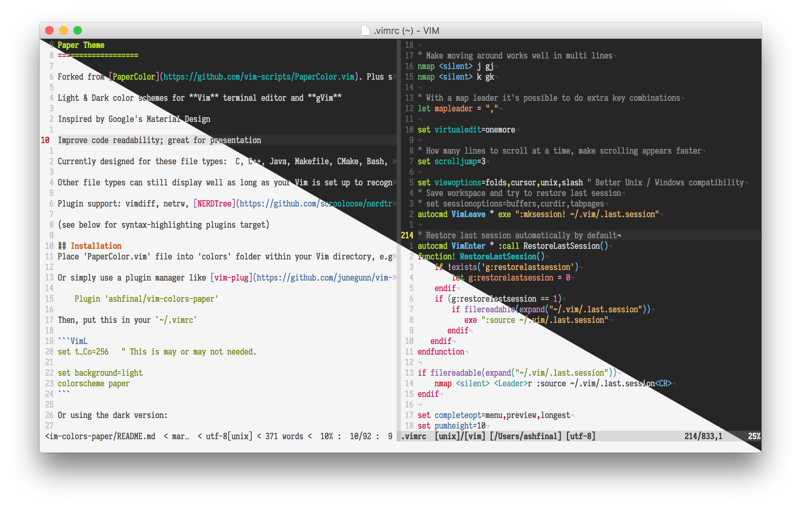
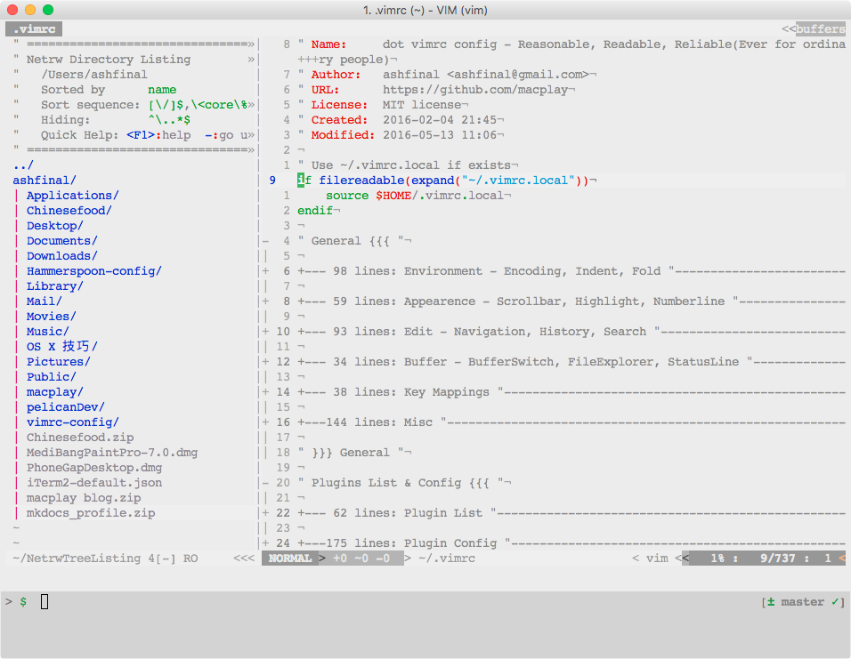

# 分享我的 vimrc 配置文件
                         _
     _ __ ___     __   _(_)_ __ ___
    | '__/ _ \____\ \ / / | '_ ` _ \
    | | |  __/_____\ V /| | | | | | |
    |_|  \___|      \_/ |_|_| |_| |_|

## 概览

介绍下我的 [.vimrc](https://raw.githubusercontent.com/ashfinal/vimrc-config/master/.vimrc) 配置文件 - `re-vim` 。项目地址为 [https://github.com/ashfinal/vimrc-config](https://github.com/ashfinal/vimrc-config)。

轻量级、自适应、可扩展。直接下载放置到主目录下，运行 vim 时将会自行加载。

最好使用编译有 lua 及 python 特性的 "huge" vim 7.4 版本。

如果你在使用 Mac 或者 Linux，终端里输入以下命令：

    curl -Lo ~/.vimrc https://j.mp/re-vim

注意到短地址的使用了嘛？这主要是为了方便新机器或者服务器，条件受限的情况下可以记忆并手动输入以上命令。(●'◡'●)

该操作应该会在 5 秒内完成，然后你就可以使用了！。

这里有个录屏，方便你更直观的了解 re-vim：

[Mac 上使用 re-vim 配置的详细步骤](http://macplay.github.io/cool-software/start-using-re-vim-config/)

如果你想要体验更多功能，请安装内置插件。插件管理器使用了 [vim-plug](https://github.com/junegunn/vim-plug), 你可以通过执行 `PlugInstall` 来进行安装。得益于 [vim-plug](https://github.com/junegunn/vim-plug)  的多线程特性，这一操作应该会在 30 秒内完成。

你也可以直接在线浏览[.vimrc](../attachment/vimrc.html)，然后 copy 其中觉得有用的配置。

## 插件

- [delimitMate][delimitMate] - 引号、括号等补全
- [neocomplete][neocomplete] - 自动完成（+lua）
- [vim-align][vim-align] - 对齐插件
- [YankRing.vim][YankRing.vim] - 多功能剪贴簿
- [goyo.vim][goyo.vim] - 无干扰模式
    - [limelight.vim][limelight.vim] - 与 [goyo.vim][goyo.vim] 配合使用
- [ultisnips][ultisnips] - 语法片段（+python）
    - [vim-snippets][vim-snippets] - ultisnips 片段搜集
- [emmet-vim][emmet-vim] - Emmet 插件: http://emmet.io/
- [vim-table-mode][vim-table-mode] - 表格编辑增强插件
- [vim-surround][vim-surround] - 配对括号、标签操作
- [vim-signature][vim-signature] - 书签可视化
- [vim-gitgutter][vim-gitgutter] - Git diff 可视化
- [nerdcommenter][nerdcommenter] - 代码注释
- [vim-airline][vim-airline] - 状态栏美化
- [vim-jsbeautify][vim-jsbeautify] - 前端代码美化（需安装 node.js）
- [undotree][undotree] - 撤销历史可视化
- [vim-easymotion][vim-easymotion] - 快速定位移动
- [vim-multiple-cursors][vim-multiple-cursors] - 多光标编辑
- [ctrlp.vim][ctrlp.vim] - 缓冲区、最近打开文件等的模糊搜索
- [vim-colors-pencil][vim-colors-pencil] - iA Writer 颜色主题
- [vim-colors-paper][vim-colors-paper] - Material Design 颜色主题

## 按键

### 主绑定

    map ; :                 Normal/Visual 模式下使用 `;` 替代 `:`
    imap jj <Esc>           Insert 模式下按 `jj` 回到 Normal 模式
    mapleader = ","         Normal 模式下将 <Leader> 键设定为 `,`

### 命令

在 Mac & *nix 系统中使用 `:W` 调用 root 写权限。

使用 `Wcolor` 显示当前光标下的颜色代码。

### 常用

| Key                  |      Mode      | Action                  |
|:---------------------|:--------------:|:------------------------|
| `<BS>`               |     Normal     | 取消搜索高亮            |
| `yo`                 |     Normal     | YankOnce 设置 paste 模式|
| `<Shift>` + `<Tab>`  |     Normal     | 跳转到下一个缓冲区      |
| `<Ctrl>` + `a`       | Command/Insert | 光标移到行首            |
| `<Ctrl>` + `c`       |     Normal     | 显示当前光标下的颜色代码|
| `<Ctrl>` + `e`       | Command/Insert | 光标移到行末            |
| `<Ctrl>` + `h`       | Command/Insert | 按单词向左移动光标      |
| `<Ctrl>` + `l`       | Command/Insert | 按单词向右移动光标      |
| `<Ctrl>` + `b`       |     Insert     | 按字符向左移动光标      |
| `<Ctrl>` + `f`       |     Insert     | 按字符向右移动光标      |
| `<Ctrl>` + `j`       |     Insert     | 按行向下移动光标        |
| `<Ctrl>` + `k`       |     Insert     | 按行向上移动光标        |
| `<Ctrl>` + `j`       |     Visual     | 将当前行向下移动        |
| `<Ctrl>` + `k`       |     Visual     | 将当前行向上移动        |
| `<Ctrl>` + `h`       |     Normal     | 拓宽分割窗口            |
| `<Ctrl>` + `l`       |     Normal     | 缩窄分割窗口            |
| `<Ctrl>` + `j`       |     Normal     | 降低分割窗口            |
| `<Ctrl>` + `k`       |     Normal     | 增高分割窗口            |

### `<Leader>` 键相关

| Key                    |  Mode  | Action                                 |
|:-----------------------|:------:|:---------------------------------------|
| `<Leader>` + `r`       | Normal | 恢复上一次关闭时窗口                   |
| `<Leader>` + `e`       | Normal | 使用 Netrw 文件浏览                    |
| `<Leader>` + `b`       | Normal | 切换背景（需颜色主题支持）             |
| `<Leader>` + `c`       | Normal | 切换显示列（比如高亮 80 列）           |
| `<Leader>` + `d`       | Normal | 切换是否将 tab 拓展为空格              |
| `<Leader>` + `f`       | Normal | 切换换行方式（mac/unix/dox）           |
| `<Leader>` + `k`       | Normal | 切换显示续行符（折行前添加 '+++'）     |
| `<Leader>` + `l`       | Normal | 切换显示隐藏字符                       |
| `<Leader>` + `m`       | Normal | 切换显示折叠层级                       |
| `<Leader>` + `n`       | Normal | 切换显示行号                           |
| `<Leader>` + `s`       | Normal | 移除行末空格和文末空行                 |
| `<Leader>` + `t`       | Normal | 切换 tab 和 空格（也可用来显示缩近线） |
| `<Leader>` + `v`       | Normal | 切换高亮当前行                         |
| `<Leader>` + `w`       | Normal | 切换是否换行                           |
| `<Leader>` + `x`       | Normal | 切换是否允许修改（只读模式）           |
| `<Leader>` + `z`       | Normal | 切换搜索折叠（也可用来显示子标题大纲） |
| `<Leader>` + `<Space>` | Normal | 切换折叠方法                           |

### 插件相关

| Plugin                                       | Key                      |      Mode     | Action                       |
|:---------------------------------------------|:-------------------------|:-------------:|:-----------------------------|
| [ctrlp.vim][ctrlp.vim]                       | `<Leader>` + `o`         |     Normal    | 打开 CtrlP 窗口              |
| [undotree][undotree]                         | `U`                      |     Normal    | 打开 undotree 窗口           |
| [YankRing.vim][YankRing.vim]                 | `<Leader>` + `y`         |     Normal    | 打开 YankRing 窗口           |
| [YankRing.vim][YankRing.vim]                 | `<Ctrl>` + `p`           |     Normal    | 使用上一个 YankRing 条目替换 |
| [YankRing.vim][YankRing.vim]                 | `<Ctrl>` + `n`           |     Normal    | 使用下一个 YankRing 条目替换 |
| [nerdcommenter][nerdcommenter]               | `\`                      | Normal/Visual | 切换代码注释                 |
| [nerdcommenter][nerdcommenter]               | `Ctrl` + `\`             | Normal/Visual | 块代码注释                   |
| [emmet-vim][emmet-vim]                       | `<Leader>` + `,`         | Insert/Visual | Emmet 展开                   |
| [vim-easymotion][vim-easymotion]             | `<Space>`                |     Normal    | 当前屏幕搜索字符             |
| [vim-multiple-cursors][vim-multiple-cursors] | `+`                      | Normal/Visual | 添加下一个光标               |
| [vim-multiple-cursors][vim-multiple-cursors] | `_`                      | Normal/Visual | 移除上一个光标               |
| [vim-multiple-cursors][vim-multiple-cursors] | `-`                      | Normal/Visual | 跳过下一个光标               |
| [vim-align][vim-align]                       | `<Leader>` + `g`         | Normal/Visual | 对齐（比如 `Align =` ）      |
| [goyo.vim][goyo.vim]                         | `Ctrl` + `w` + `<Space>` |     Normal    | 切换无干扰模式               |
| [limelight.vim][limelight.vim]               | `Ctrl` + `w` + `<Enter>` |     Normal    | 切换 limelight 舞台模式      |
| [ultisnips][ultisnips]                       | `ii`                     |     Insert    | 展开语法片段                 |
| [ultisnips][ultisnips]                       | `<Tab>`                  |     Insert    | ultisnips 向前跳转           |
| [ultisnips][ultisnips]                       | `<Shift> + <Tab>`        |     Insert    | ultisnips 向后跳转           |
| [vim-jsbeautify][vim-jsbeautify]             | `<Leader>` +  `j` + `s`  |     Normal    | 调用 JsBeauty 美化           |

更多按键绑定请参阅相应插件主页或手册。

## 定制

re-vim 使用 `~/.vimrc.before` 和 `~/.vimrc.after` 来满足定制化需求。

比如想要修改默认的颜色主题：

    echo "colorscheme paper" >> ~/.vimrc.after

想要添加新的插件，你应该创建 `~/.vimrc.plug` 文件：

    echo "Plug 'altercation/vim-colors-solarized'" >> ~/.vimrc.plug

## 其它

re-vim 配置参考了部分网络资料。比如 [spf13-vim](https://github.com/spf13/spf13-vim) 和 [amix-vimrc](https://github.com/amix/vimrc)，同时做了一些大胆的改进。尽管经过较长时间的打磨，因水平有限难免有疏漏，如有任何问题欢迎随时联系我～

[delimitMate]:https://github.com/Raimondi/delimitMate "https://github.com/Raimondi/delimitMate"
[neocomplete]:https://github.com/Shougo/neocomplete.vim "https://github.com/Shougo/neocomplete.vim"
[vim-align]:https://github.com/ashfinal/vim-align "https://github.com/ashfinal/vim-align"
[YankRing.vim]:https://github.com/vim-scripts/YankRing.vim "https://github.com/vim-scripts/YankRing.vim"
[goyo.vim]:https://github.com/junegunn/goyo.vim "https://github.com/junegunn/goyo.vim"
[limelight.vim]:https://github.com/junegunn/limelight.vim "https://github.com/junegunn/limelight.vim"
[ultisnips]:https://github.com/SirVer/ultisnips "https://github.com/SirVer/ultisnips"
[vim-snippets]:https://github.com/honza/vim-snippets "https://github.com/honza/vim-snippets"
[emmet-vim]:https://github.com/mattn/emmet-vim "https://github.com/mattn/emmet-vim"
[vim-table-mode]:https://github.com/dhruvasagar/vim-table-mode "https://github.com/dhruvasagar/vim-table-mode"
[vim-surround]:https://github.com/tpope/vim-surround "https://github.com/tpope/vim-surround"
[vim-signature]:https://github.com/kshenoy/vim-signature "https://github.com/kshenoy/vim-signature"
[vim-gitgutter]:https://github.com/airblade/vim-gitgutter "https://github.com/airblade/vim-gitgutter"
[nerdcommenter]:https://github.com/scrooloose/nerdcommenter "https://github.com/scrooloose/nerdcommenter"
[vim-airline]:https://github.com/bling/vim-airline "https://github.com/bling/vim-airline"
[vim-jsbeautify]:https://github.com/maksimr/vim-jsbeautify "https://github.com/maksimr/vim-jsbeautify"
[undotree]:https://github.com/mbbill/undotree "https://github.com/mbbill/undotree"
[vim-easymotion]:https://github.com/Lokaltog/vim-easymotion "https://github.com/Lokaltog/vim-easymotion"
[vim-multiple-cursors]:https://github.com/terryma/vim-multiple-cursors "https://github.com/terryma/vim-multiple-cursors"
[ctrlp.vim]:https://github.com/ctrlpvim/ctrlp.vim "https://github.com/ctrlpvim/ctrlp.vim"
[vim-colors-pencil]:https://github.com/reedes/vim-colors-pencil "https://github.com/reedes/vim-colors-pencil"
[vim-colors-paper]:https://github.com/ashfinal/vim-colors-paper "https://github.com/ashfinal/vim-colors-paper"
