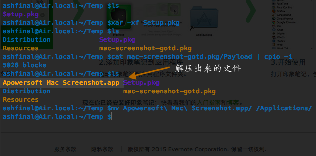

# 如何解压 Mac OS X 下的 PKG 文件

有时候我们可能需要解包 PKG 格式的安装文件包，在 OS X 系统下完成该操作并不需要你额外再安装软件，系统内置的命令就可以。步骤也比较简单：

    :::bash
    xar -xf Setup.pkg
    cat mac-screenshot-gotd.pkg/Payload | cpio -i

鉴于截图部分已经很清晰明白，就不多废话了。参考资料来自：[这里][original article]

原文讲的是 Linux 系统下解压 PKG 文件，步骤略有不同。有需要请自取。

[original article]:http://www.hoverlees.com/blog/?p=303 "http://www.hoverlees.com/blog/?p=303"
